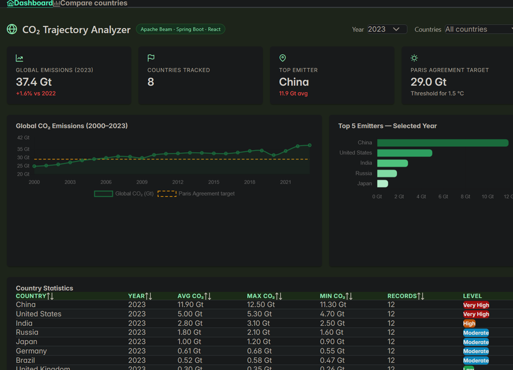

# CO₂ Trajectory Analyzer

A full-stack data engineering project that processes historical CO₂ emissions data using an **Apache Beam pipeline**, exposes the results through a **Spring Boot REST API**, and visualizes them in a **React dashboard**.



> **Live demo:** [co2-trajectory-analyzer-frontend-s9.vercel.app](https://co2-trajectory-analyzer-frontend-s9.vercel.app)
> **Status:** Frontend complete and live. Backend pipeline in active development.
> **Pipeline walkthrough:** [youtube.com/watch?v=sV6d5WAzFm0](https://youtu.be/sV6d5WAzFm0?si=wd2DQT6tLwUcs3HC)

---

## Architecture

```
CSV data source
      │
      ▼
┌─────────────────────────────────┐
│       Apache Beam Pipeline      │
│                                 │
│  ParseCsvLine                   │
│    → FilterByPeriod             │
│      → AggregateCountryStats    │
│        → PostgresWriter         │
└────────────────┬────────────────┘
                 │ writes to
                 ▼
          PostgreSQL (Docker)
                 │
                 ▼
┌─────────────────────────────────┐
│      Spring Boot REST API       │
│                                 │
│  GET /api/country-stats         │
│  GET /api/global-timeline       │
└────────────────┬────────────────┘
                 │ consumed by
                 ▼
┌─────────────────────────────────┐
│        React Dashboard          │
│                                 │
│  KPI cards · Line chart         │
│  Bar chart · DataTable          │
│  Country filter · Comparator    │
└─────────────────────────────────┘
```

---

## Tech Stack

| Layer | Technology |
|-------|-----------|
| Pipeline | Java 17, Apache Beam (DirectRunner) |
| Database | PostgreSQL 15 (Docker) |
| Backend | Spring Boot 3, Spring Data JPA |
| Frontend | React 18, PrimeReact, Chart.js, Axios |
| Deploy | Vercel (frontend), Docker Compose (infra) |

---

## Project Structure

```
co2-trajectory-analyzer/
│
├── pipeline/                        # Apache Beam (Java)
│   └── src/main/java/
│       ├── Co2Record.java           # data model
│       ├── ParseCsvLine.java        # CSV parsing transform
│       ├── FilterByPeriod.java      # date range filter transform
│       ├── AggregateCountryStats.java  # aggregation transform (in progress)
│       ├── PostgresWriter.java      # sink to PostgreSQL (in progress)
│       └── Co2Pipeline.java        # pipeline entrypoint
│
├── backend/                         # Spring Boot (Java)
│   └── src/main/java/
│       ├── controller/
│       │   └── Co2Controller.java   # REST endpoints (in progress)
│       ├── service/
│       │   └── Co2Service.java
│       ├── repository/
│       │   └── CountryStatsRepository.java
│       └── model/
│           └── CountryStats.java
│
├── frontend/                        # React
│   ├── src/
│   │   ├── services/api.js          # axios layer (swap mock → real in one line)
│   │   ├── components/
│   │   │   ├── KpiCard.jsx
│   │   │   ├── EmissionsChart.jsx
│   │   │   └── CountryTable.jsx
│   │   └── pages/
│   │       ├── Dashboard.jsx
│   │       └── Compare.jsx          # country comparator
│   └── package.json
│
├── docker-compose.yml               # PostgreSQL + future services
├── init.sql                         # DB schema
└── README.md
```

---

## The Pipeline

The Beam pipeline reads raw CSV emissions data and processes it through a series of transforms:

```
ReadFromText  →  ParseCsvLine  →  FilterByPeriod  →  AggregateCountryStats  →  PostgresWriter
```

Each transform is an independent `PTransform`, making them individually testable and reusable.

**`ParseCsvLine`** — maps each raw CSV line into a typed `Co2Record` (country, year, value), handling malformed rows gracefully with a dead-letter pattern.

**`FilterByPeriod`** — filters records by a configurable start/end year range passed as pipeline options, so the same code can process any time window.

**`AggregateCountryStats`** — groups by `(country, year)` and computes `avg`, `max`, `min`, and `total` CO₂ per group using Beam's `Combine` transforms.

**`PostgresWriter`** — writes aggregated results to PostgreSQL using a `DoFn` with JDBC, performing an upsert (`INSERT ... ON CONFLICT DO UPDATE`) to make the pipeline safely re-runnable.

---

## Frontend Design Decisions

The frontend was built with a clear separation between the data layer and the UI layer.

**`src/services/api.js`** is the only file that knows where data comes from. It currently serves mock JSON that mirrors the exact shape the Spring Boot API will return. Switching to the real backend requires changing two lines:

```js
// current (mock)
const USE_MOCK = true;
const BASE_URL = 'http://localhost:8080/api';

// after backend is live
const USE_MOCK = false;
const BASE_URL = 'https://your-api.com/api';
```

Every component (`KpiCard`, `EmissionsChart`, `CountryTable`) receives data as props and has no knowledge of where it came from — making them straightforward to test and reuse.

---

## Running Locally

**Prerequisites:** Docker, Node.js 18+, Java 17+, Maven

```bash
# 1. Start PostgreSQL
docker-compose up -d postgres

# 2. Run the Beam pipeline
cd pipeline
mvn compile exec:java -Dexec.mainClass="Co2Pipeline"

# 3. Start the Spring Boot API
cd backend
mvn spring-boot:run

# 4. Start the React frontend
cd frontend
npm install
npm run dev
```

The dashboard will be available at `http://localhost:5173`.

---

## What's Next

- [ ] Complete `AggregateCountryStats.java` Beam transform
- [ ] Complete `PostgresWriter.java` with JDBC upsert
- [ ] Build Spring Boot REST controllers and JPA repositories
- [ ] Connect frontend to live API (single flag change in `api.js`)
- [ ] Add pipeline unit tests with `TestPipeline`
- [ ] Docker Compose with all services (pipeline + API + frontend)

---

## About

Built as a hands-on project to practice data engineering concepts — specifically distributed data processing with Apache Beam, which is the same programming model used by Google Dataflow and Apache Flink.

The dataset used is publicly available CO₂ emissions data from [Our World in Data](https://ourworldindata.org/co2-emissions).
